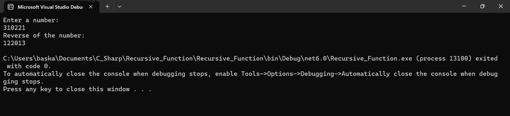

# RECURSIVE - FUNCTION
## AIM: 
To write a C# program to reverse a number using recursive function.

## ALGORITHM:
### Step1:
Create a function for reversing.
### Step2:
Get the number from the user.
### Step3:
In the function find reminder of the number and multiply it by 10 and add the reverse number.
### Step4:
Recusively call this function to get the reversed number.
### Step5:
Print the reversed number.

## PROGRAM:
```
NAME : PAARKAVY B
REG NO : 212221230072
```

```
using System;
namespace Recursive
{
    class Program
    {
        public static int m, rev = 0;
        public static int Reverse(int n)
        {

            if (n > 0)
            {
                m = n % 10;
                rev = rev * 10 + m;
                n /= 10;
                return Reverse(n);
            }
            return rev;

        }
        static void Main(string[] args)
        {
            int num;
            Console.WriteLine("Enter a number:");
            num = Convert.ToInt32(Console.ReadLine());
            Console.WriteLine("Reverse of the number:");
            Console.WriteLine(Reverse(num));
        }
    }
}
```

## OUTPUT:


## RESULT:
Thus , a C# program to reverse a number using recursive function is executed successfully.
